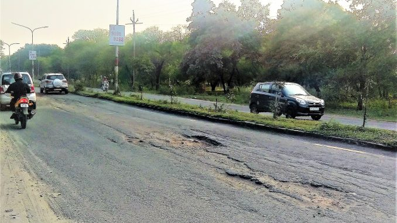
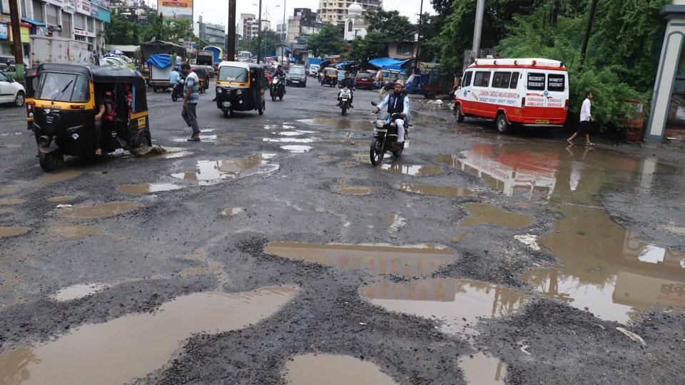

# Pothole-Detection-and-Segmentation
Pothole detection and segmentation using [Mask R-CNN](https://github.com/matterport/Mask_RCNN)

## Result

<!--     -->
<!--    -->
  

  

<!--     -->
<!--    -->
  

<!--     -->
<!--    -->
  

<!--     -->
<!--    -->
  

## Reference
- Mask R-CNN by [matterport](https://github.com/matterport/Mask_RCNN)
- [Getting started with Mask R-CNN](https://gilberttanner.com/blog/getting-started-with-mask-rcnn-in-keras) by Gilbert Tanner
- Images annotation tool [labelme](https://github.com/wkentaro/labelme)
